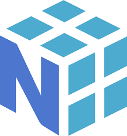

<!---->

## *Hi there,  👋 I'm Pasindu Sandeep. A 4th-year undergraduate in the [Department of Electronic and Telecommunication Engineering](https://ent.uom.lk/) at the [University of Moratuwa](https://uom.lk/) in [Sri Lanka](https://en.wikipedia.org/wiki/Sri_Lanka).*

<table align="center">
  <tr>
    <td width="70%">
      - 📈 I believe in applying my knowledge rather than continuously learning without practical application. After graduation, I joined the industry to solve real-world problems while exploring new areas of interest. 
      - 🌱 I’m currently refreshing my knowledge on Data Structures and Algorithms, Object-Oriented Programming in C++ and Python, as well as Machine Learning and anything else that piques my interest.  
      - 💬 Ask me about anything (https://github.com/pasindu201/pasindu201/issues). If it's something I know, I'd be happy to help! 😉
    </td>
    <td width="30%" align="center">
      

  
    </td>
  </tr>
</table>

### *My Statics*

<table align="center">
<tr border="1" cellpadding="10">
<td width="60%" align="center">  
  
     
   
</td>
<td width="40%" align="center">
  
  </td>
</tr>
</table>

  

---

### *My Skills*

**Programming Languages   :**
<code></code>
<code></code>
<code></code>
<code></code>
<code></code>
<code></code>
<code></code>
<code></code>

**Frontend Development   :**
<code></code>
<code></code>
<code></code>
<code></code>

**Backend Development   :**
<code></code>
<code></code>
<code></code>

**Backend as a Service :**
<code></code>

**Data Bases           :**
<code></code>
<code></code>
<code></code>

**Mobile App Development   :**
<code></code>
<code></code>
<code></code>

**Frameworks   :**
<code></code>
<code></code>

**AI/ML   :**
<code></code>
<code></code>

**IOT :**
<code></code>
<code></code>

   

